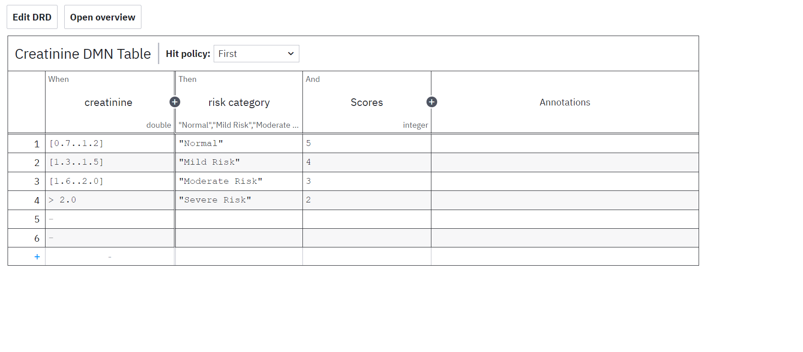
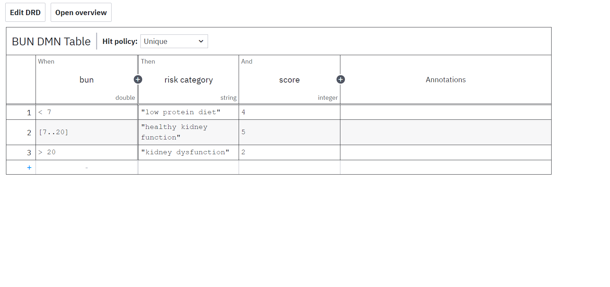
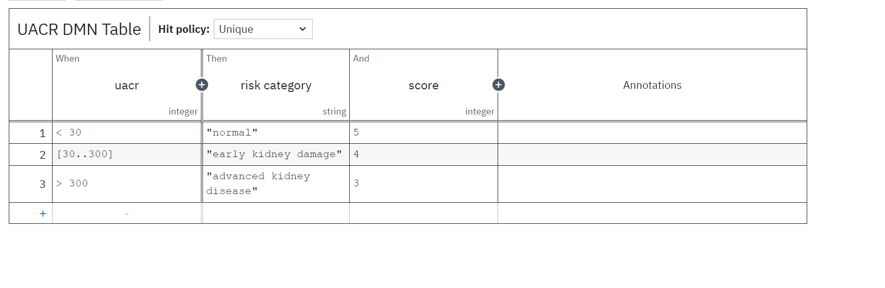
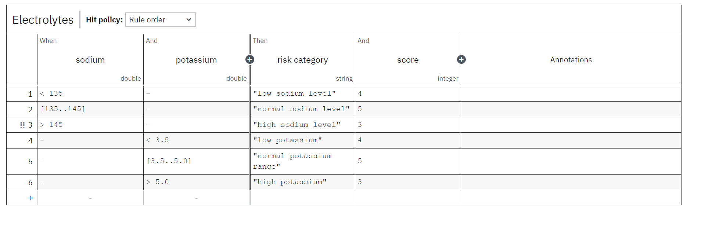
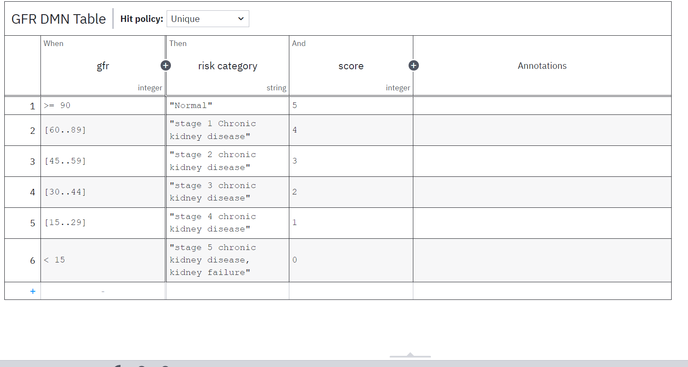

#INTERNSHIP DOCUMENTATION

## Introduction
This documentation outlines my journey of learning and implementing Camunda for processing kidney test results and calculating kidney scores using DMN (Decision Model and Notation) tables. The project involves integrating Camunda with external applications to automate decision-making based on clinical guidelines.

## Learning Camunda
Initially, I explored Camunda BPM to understand its workflow automation and decision management capabilities. I started by deploying simple BPMN workflows and DMN tables to get hands-on experience with the platform. Through this learning phase, I discovered that for my use case—processing kidney test results—DMN tables would be the best approach for structured decision-making.

## Understanding DMN Tables
I researched DMN and realized that I could define decision logic using tables, making it easier to standardize and automate medical test result evaluations. I learned how to:
- Create DMN tables using Camunda Modeler.
- Deploy DMN tables to Camunda Cockpit.
- Test decision tables using Postman.

## Implementing DMN for Kidney Test Results
After understanding DMN, I designed individual decision tables for each kidney test based on standard clinical guidelines:

### 1. Creatinine DMN Table
The **Creatinine DMN Table** evaluates creatinine levels and determines whether the levels are normal, mild risk, moderate risk, or severe risk, aiding in kidney function assessment.
- **Image:** 

### 2. BUN (Blood Urea Nitrogen) DMN Table
The **BUN DMN Table** assesses blood urea nitrogen levels. It classifies the results as low protein diet, healthy kidney function, or kidney dysfunction.
- **Image:** 

### 3. UACR (Urine Albumin-to-Creatinine Ratio) DMN Table
The **UACR DMN Table** evaluates the albumin-to-creatinine ratio in urine. It classifies results as normal, early kidney damage, or advanced kidney disease.
- **Image:** 

### 4. Electrolytes (Potassium, Sodium) DMN Table
The **Electrolytes DMN Table** checks potassium and sodium levels to determine if they are within normal ranges, aiding in electrolyte balance assessment.
- **Image:** 

### 5. GFR (Glomerular Filtration Rate) DMN Table
The **GFR DMN Table** calculates the glomerular filtration rate based on input parameters. It classifies kidney function into different stages, helping to diagnose chronic kidney disease.
- **Image:** 

## Deployment and Testing
I successfully deployed a single DMN table in Camunda and tested it using Postman. Then, I deployed all individual DMN tables directly from Camunda Modeler to Cockpit and tested the results.

## Integration with External Application
To fully automate the workflow, I planned the following integration steps:
1. **Data Extraction**: A user uploads kidney test results in PDF or image format.
2. **Processing**: A Java program extracts relevant test data.
3. **Decision Making**: The extracted data is sent to Camunda DMN tables via REST API.
4. **Final Decision**: Camunda processes the data and returns a decision.
5. **User Interaction**: The final decision is sent back to the user via the webpage.

## Conclusion
By integrating Camunda DMN with external applications, I automated the kidney test evaluation process. This structured approach ensures accurate, standardized, and efficient decision-making in medical diagnostics.
